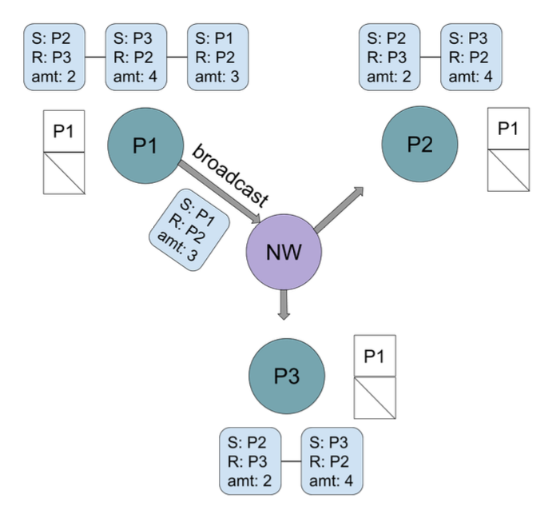

# Blockchain project

This is a simple version of teh blockchain. There are three client nodes and one server node. Each client node starts with a balance of $10, and can transfer money to other users through command-line interface. For each transfer, the process will request exclusive access to the blockchain via Lamport mutual exclusion. Upon receiving access, the process will add a block containing the money transfer to its local copy of the blockchain. The process will broadcast this update to all other processes before releasing the resource.
---
# Run project

---
# Command Manual (on each process console window)
1. `print` -> prints event list which reacodes each actions and transactions
2. `print1` -> prints current balance for specific node
3. `print2` -> prints the whole blockchain
4. `done` -> disconnect wiht server 
5. `transfer` and enter key. Then, enter the amount of money transfer (max is 100) and target process ID. 
---

