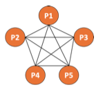
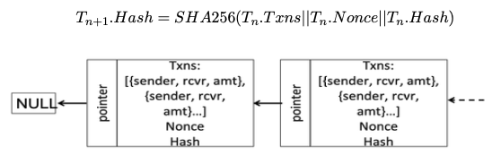

# Blockchain project

This a simplified version of a Blockchain using Paxos as a consensus protocol. There are one server and five client processes. This is a peer to peer money exchange application on top of private Blockchain to create a trusted but fault tolerant decentralized system such that transactions between two clients can be executed without any middle-man.

---
# Run project

1. Run server main. It is name NetWorkProcess under server folder
2. Run five processes one by one. It is name Process under client folder. They will be sign ID number from 1 to 5.
---
# Command Manual (on each process console window)
1. `print` -> prints event list which reacodes each actions and transactions
2. `print1` -> prints current balance for specific node
3. `print2` -> prints the whole blockchain
4. `done` -> disconnect wiht server 
5. `transfer` and enter key. Then, enter the amount of money transfer (max is 100) and target process ID. 
---
# Hash Structure

